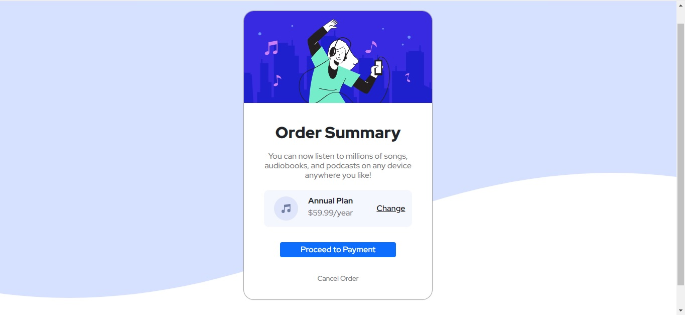

# Frontend Mentor - Order summary card


## Table of contents

- [Overview](#overview)
  - [The challenge](#the-challenge)
  - [My design](#my-design)
  - [Where to find everything](#where-to-find-everything)
  - [Link to site](#link-to-site)
- [My process](#my-process)
  - [Built with](#built-with)
  - [What I learned](#what-i-learned)
  - [Continued development](#continued-development)
- [Author](#author)

<br>

# Overview

## The challenge

The challenge is to build out this order summary card component and get it looking as close to the design as possible.

<br>

## My design



## Where to find everything

-- The designs are inside the `/design` folder. You will find both a mobile and a desktop version of the design. 

-- The designs are in JPG static format. Using JPGs will mean that you'll need to use your best judgment for styles such as `font-size`, `padding` and `margin`. 

-- You will find all the required assets in the `/images` folder. The assets are already optimized.

-- The css's archives are in `scss` folder.

### Link to site

- Live Site URL: [order-summary-card-tesche.netlify.app](https://order-summary-card-tesche.netlify.app/)

<br>

## My process

### Built with

- Semantic HTML5 markup
- CSS custom properties
- Flexbox
- BootStrap
- SCSS

<br>

### What I learned

Building this project, I learned about HTML semantics, CSS custom properties, Flexbox and BootStrap. I also learned how to use "@mixin", "@include" and ":root" in CSS and new way to write css. 

```css
.buttonPay{
    margin-top: 30px;
    @include font;
    font-size: 1em;

    button{
        padding: 2px 40px;
    }
}
```
<br>

### Continued development

I want to add JavaScript to can choice new options of plans.
<br>
## Author

- Author - Thiago Tesche
- Frontend Mentor - [@ThiagoTesche](https://www.frontendmentor.io/profile/ThiagoTesche)
- Instagram - [@thiago_tesche](https://www.instagram.com/thiago_tesche/)
- LinkedIn - [Thiago Tesche](https://www.linkedin.com/in/thiago-tesche-996b52213/)


<strong>Thank You!</strong>